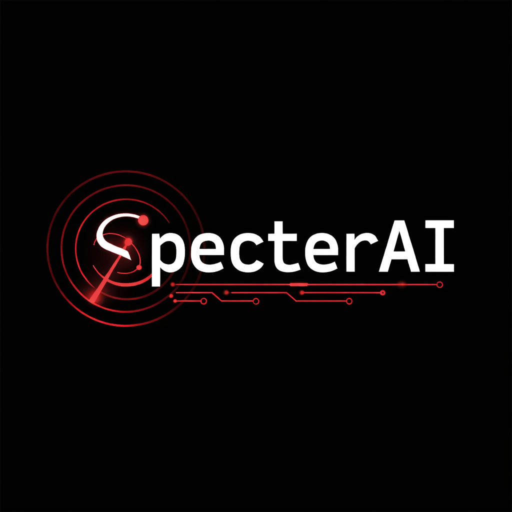
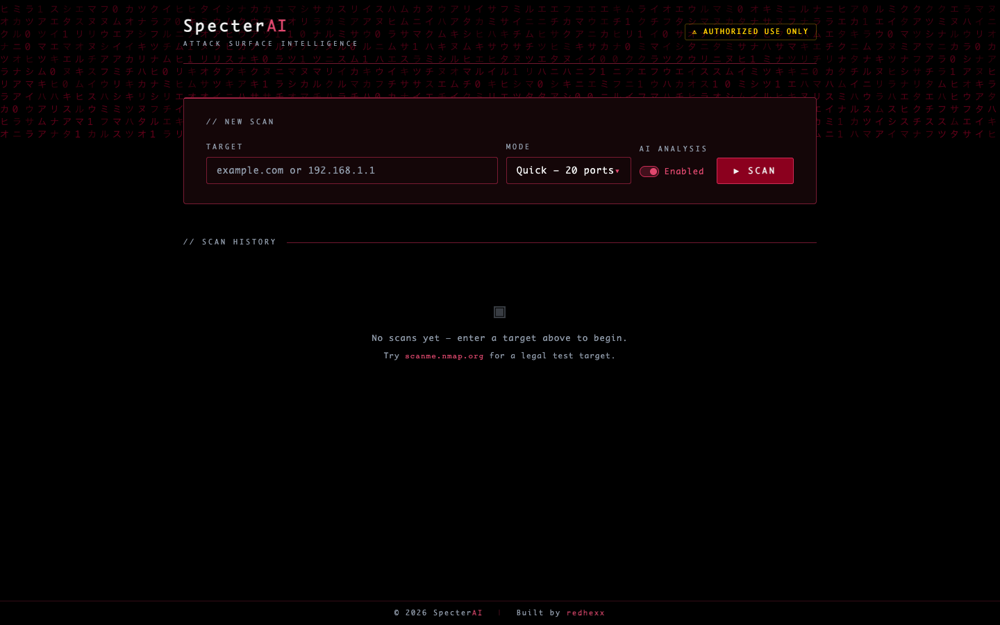
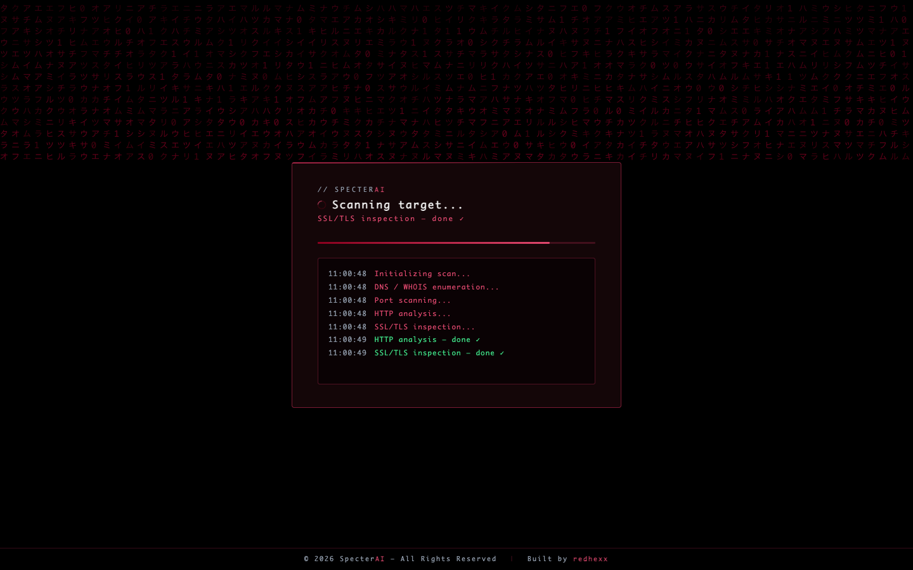
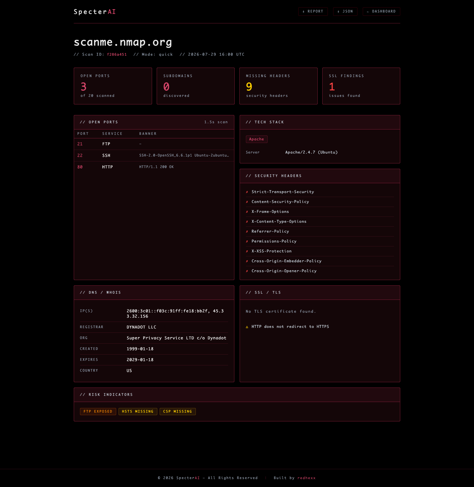

<div align="center">



# SpecterAI

**Attack Surface Intelligence Platform** — recon tool powered by Claude AI.

[](LICENSE)
[](https://www.python.org/)
[](https://claude.com/claude-code)

[Live Demo](https://specter-ai-8p3g.onrender.com) · [Report a Bug](https://github.com/hiratinspace/specter-ai/issues) · [Usage](#usage)

</div>

> **For authorized security testing only.** Do not scan systems you don't own or don't have explicit written permission to test.

---

## Screenshots

| Dashboard | Live Scan Progress | Report View |
|---|---|---|
|  |  |  |

> The live demo runs on Render's free tier, so the first request after inactivity can take ~50s to wake up.

---

## Table of contents

- [What it does](#what-it-does)
- [Usage](#usage)
  - [CLI](#cli)
  - [Web dashboard](#web-dashboard)
- [Requirements](#requirements)
- [Project structure](#project-structure)
- [License](#license)

---

## What it does

Runs four recon modules in parallel against a target domain or IP, then sends the aggregated findings to Claude for AI-driven analysis and risk assessment. Outputs a structured Markdown report — or view it live in the web dashboard with real-time progress over SSE.

| Module | What it collects |
|---|---|
| DNS / WHOIS | Subdomains, registrar info, DNS records |
| Port scan | Open ports (top 20 quick / top 1000 full) |
| HTTP probe | Headers, server info, security misconfigs |
| SSL/TLS | Certificate details, cipher weaknesses |

---

## Usage

### CLI

```bash
pip install -r requirements.txt
export ANTHROPIC_API_KEY=your_key_here

python specter-ai.py --target example.com --mode quick
python specter-ai.py --target example.com --mode full --output report.md
python specter-ai.py --target example.com --no-ai   # skip AI analysis
```

**Flags**

| Flag | Description |
|---|---|
| `--target / -t` | Target domain or IP (required) |
| `--mode / -m` | `quick` (top 20 ports) or `full` (top 1000). Default: `quick` |
| `--output / -o` | Output filename. Default: `<target>_report.md` |
| `--no-ai` | Skip Claude analysis (offline / no API key) |

### Web dashboard

```bash
python3 web/app.py
# Open http://localhost:5000
```

Real-time scan progress via SSE, with a full report view and scan history on completion. Try it against a legal test target:

```bash
python3 specter-ai.py --target scanme.nmap.org
```

---

## Requirements

- Python 3.10+
- `ANTHROPIC_API_KEY` environment variable (for AI analysis)

```
anthropic>=0.25.0
dnspython>=2.4.0
python-whois>=0.9.0
requests>=2.31.0
flask>=3.0.0
gunicorn>=21.2.0
```

---

## Project structure

```
specter-ai.py        # CLI entrypoint
web/app.py           # Flask web dashboard
modules/             # dns_enum, port_scan, http_probe, ssl_check
core/                # aggregator, ai_analyst (Claude integration)
report/              # Markdown report generator
assets/screenshots/  # README screenshots
```

---

## License

Apache License 2.0 — see [LICENSE](LICENSE).

---

<div align="center">

Built with Python and Claude Code, by **Hirat Rahman Rahi** — first released April 8, 2026.

</div>
